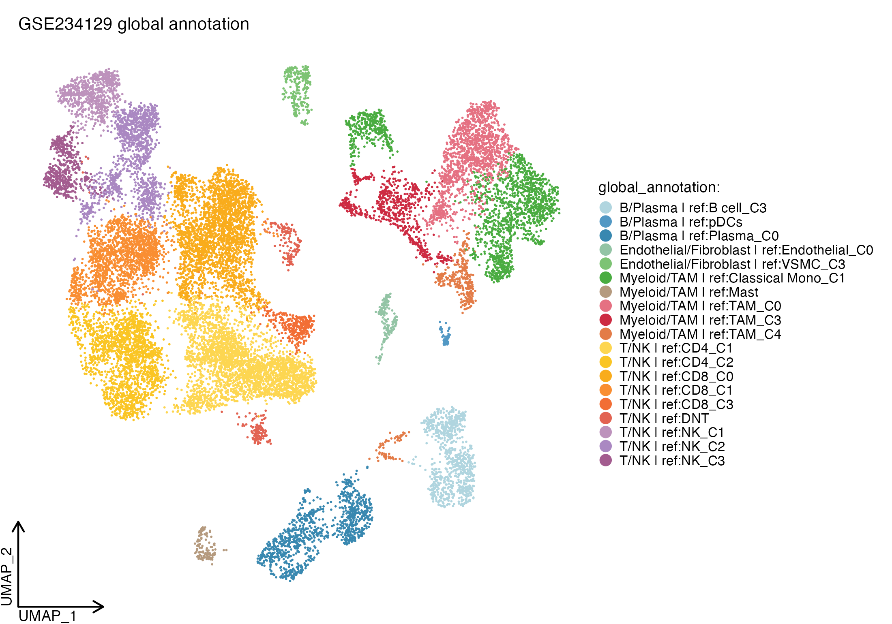
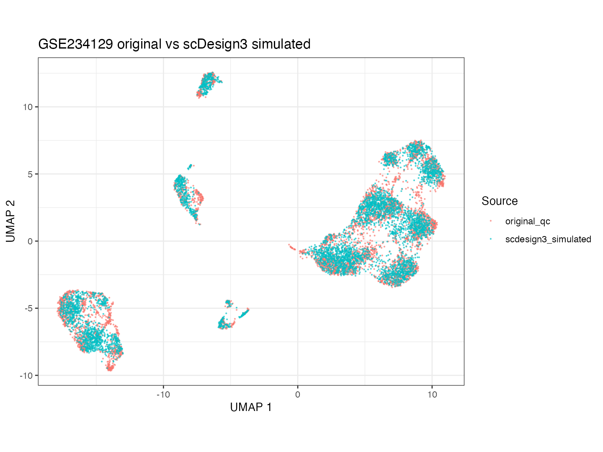
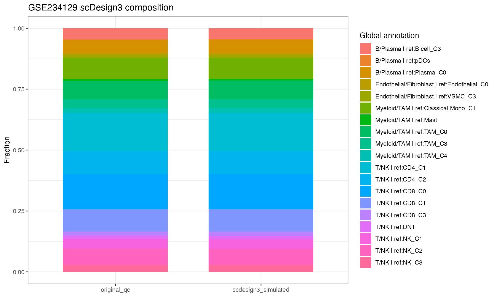
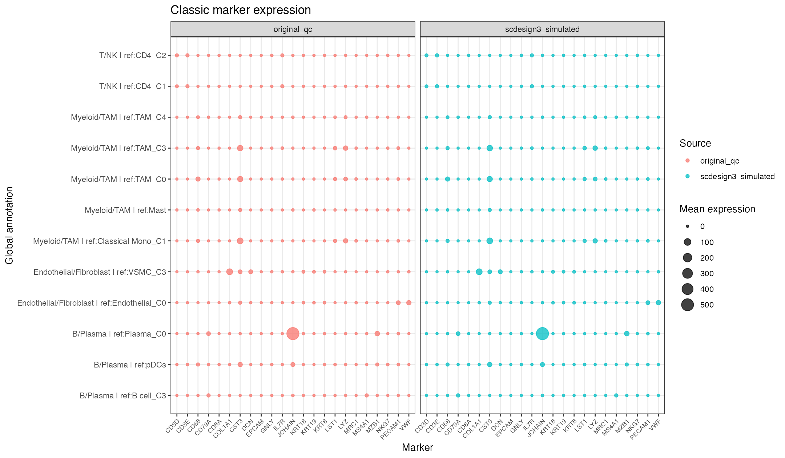
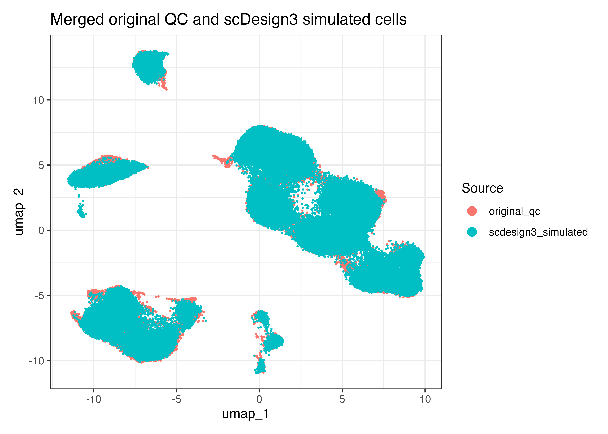
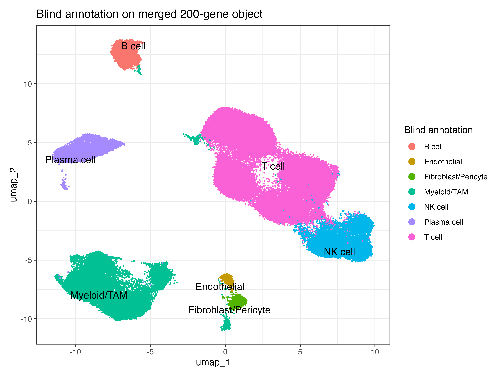
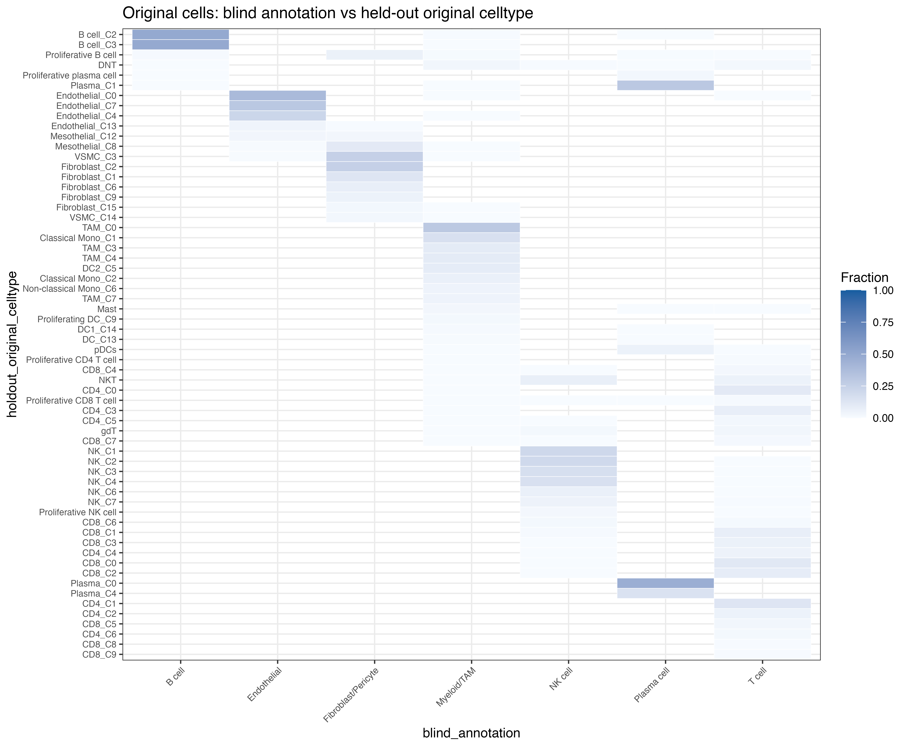
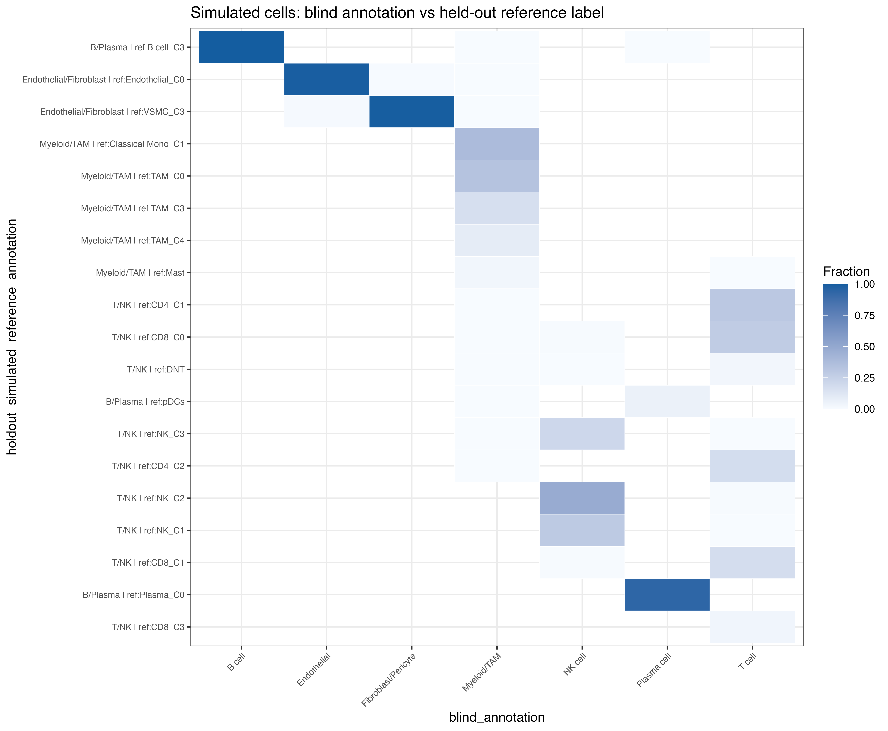
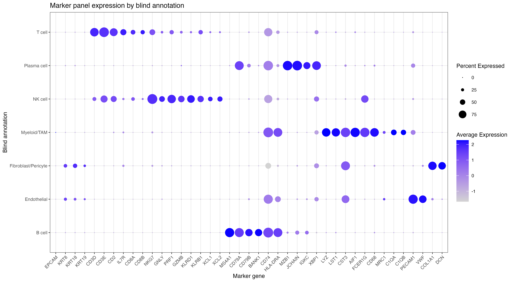
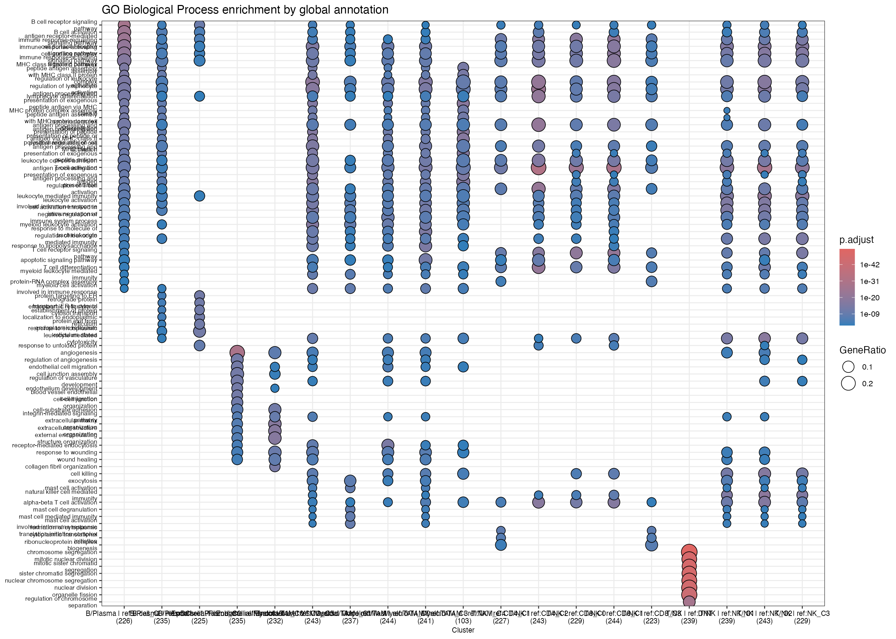

# Gastric Cancer Single-Cell Analysis

This repository provides a reproducible workflow for gastric cancer single-cell transcriptomics analysis, with public-facing figures and reports that summarize the current GSE234129 analysis. The project combines Python/Scanpy, R/Seurat/scop, scDesign3 simulation, SingleR/celldex-based reference annotation, and downstream differential expression/enrichment analysis.

## Highlights

The current analysis focuses on public GEO dataset `GSE234129` and covers raw data preparation, QC, clustering, cell population annotation, publication-style visualization, differential expression, pathway enrichment, scDesign3 simulation, and direct comparison between original and simulated cells.

The main simulation/comparison result uses 19,144 QC-filtered original cells as the baseline, generates 76,576 simulated cells with `scDesign3`, merges original and simulated cells on 200 shared genes, and performs blind reannotation without using the original labels during annotation. Existing `celltype` and simulated reference labels are used only as held-out labels for final comparison.

Key metrics:

| Comparison | ARI | NMI | Interpretation |
| --- | ---: | ---: | --- |
| Original cells: blind annotation vs fine original `celltype` | 0.120 | 0.504 | Fine-subtype agreement is limited, as expected from the 200-gene input. |
| Original cells: blind broad lineage vs original broad lineage | 0.898 | 0.828 | Broad lineage structure is well recovered. |
| Simulated cells: blind annotation vs reference labels | 0.310 | 0.661 | Fine reference labels are partly collapsed by blind annotation. |
| Simulated cells: blind broad lineage vs reference broad lineage | 0.999 | 0.996 | Simulated cells preserve broad lineage structure very well. |

## Figure Gallery

### 1. Main Cell Annotation Structure

QC-filtered cells form major T/NK, B/Plasma, Myeloid/TAM, and stromal compartments in UMAP space.

<p align="center">
  
</p>

### 2. scDesign3 Original vs Simulated Cells

The four-fold scDesign3 simulation evaluates whether the current analysis preserves major expression structures in generated data. The UMAP, composition plot, and marker dotplot compare original QC cells and simulated cells.

| Original vs simulated UMAP | Cell composition comparison |
| --- | --- |
|  |  |

| Original vs simulated marker expression |
| --- |
|  |

### 3. Blind Reannotation After Merging Original and Simulated Cells

To avoid inheriting prior labels, the merged original/simulated object is reclustered and reannotated with marker panels plus `SingleR`/`celldex` HPCA. Original labels are reattached only after blind annotation for held-out comparison.

| Merged object by source | Merged object by blind annotation |
| --- | --- |
|  |  |

| Original cells: blind annotation vs held-out `celltype` | Simulated cells: blind annotation vs reference label |
| --- | --- |
|  |  |

| Blind annotation marker dotplot |
| --- |
|  |

Interpretation notes:

- `Cluster 15`: marker scoring favors `Myeloid/TAM`, but `SingleR` points to endothelial identity. This is the most ambiguous cluster and should be interpreted cautiously.
- `Cluster 17`: supported by `S100A8`, `FCN1`, `S100A9`, and `LYZ`; it is 96.3% original cells, suggesting a real-data inflammatory monocyte/myeloid state that is under-represented in the simulation.
- `Cluster 18`: `JCHAIN`, `MZB1`, and `DERL3` support a plasma-cell tendency, but `SingleR` mapping is unstable, so this should not be used for fine plasma subtype claims.

Reports:

- [English HTML report](results/GSE234129/reports/GSE234129_raw_simulated_200gene_blind_annotation_english_report.html)
- [Chinese HTML report](results/GSE234129/reports/GSE234129_raw_simulated_200gene_blind_annotation_chinese_report.html)
- [Markdown analysis report](results/GSE234129/reports/GSE234129_raw_simulated_200gene_blind_annotation_comparison_report.md)

### 4. Differential Expression and Pathway Enrichment

Differential marker results are summarized from Leiden 0.5 clusters and global annotations, followed by ORA enrichment for GO Biological Process, KEGG, Reactome, and MSigDB Hallmark gene sets.

<p align="center">
  
</p>

## Dataset

GSE234129 source:

```text
https://www.ncbi.nlm.nih.gov/geo/query/acc.cgi?acc=GSE234129
```

GEO supplementary download directory:

```text
https://ftp.ncbi.nlm.nih.gov/geo/series/GSE234nnn/GSE234129/suppl/
```

Dataset scale:

- 19,488 raw cells
- 27,176 genes/features
- 6 patients
- 17 samples
- 62 existing cell type labels

Raw and processed matrix files are intentionally excluded from Git. Recreate them with:

```bash
/Users/huangfulongtao/micromamba/envs/biomni_e1/bin/python Datasets/GSE234129/scripts/make_scanpy_h5ad.py
Rscript Datasets/GSE234129/scripts/make_seurat_rds.R
```

## Reproducible Workflows

### Scanpy QC, Clustering, and Marker Annotation

```bash
/Users/huangfulongtao/micromamba/envs/biomni_e1/bin/python scripts/python/01_gse234129_qc.py
/Users/huangfulongtao/micromamba/envs/biomni_e1/bin/python scripts/python/02_gse234129_clustering.py
/Users/huangfulongtao/micromamba/envs/biomni_e1/bin/python scripts/python/03_gse234129_marker_annotation.py
```

Main local outputs:

- `results/GSE234129/objects/GSE234129_qc_filtered.h5ad`
- `results/GSE234129/objects/GSE234129_clustered.h5ad`
- `results/GSE234129/objects/GSE234129_annotated.h5ad`
- `results/GSE234129/tables/GSE234129_cluster_annotation.tsv`
- `results/GSE234129/tables/GSE234129_leiden05_markers.tsv`

### scop Plotting and Extended Analysis

```bash
/Users/huangfulongtao/micromamba/envs/biomni_e1/bin/python scripts/python/export_gse234129_scop_inputs.py
Rscript scripts/R/04_gse234129_scop_plots.R
Rscript scripts/R/08_gse234129_scop_extended_analysis.R
```

The extended workflow adds `GroupHeatmap`, `CellCorHeatmap`, raw-vs-QC similarity checks, Slingshot trajectory inference, pseudotime projection plots, and dynamic heatmaps for eligible lineages.

Main outputs:

- Figures: `results/GSE234129/figures/scop/` and `results/GSE234129/figures/scop_extended/`
- Tables: `results/GSE234129/tables/scop_extended/`
- Report: `results/GSE234129/reports/GSE234129_scop_extended_analysis_report.md`

### Differential Expression and Enrichment

```bash
Rscript scripts/R/09_gse234129_de_enrichment_analysis.R
```

This workflow summarizes Scanpy Wilcoxon Leiden 0.5 marker results, creates volcano panels, marker-count plots, top-marker heatmaps, and ORA enrichment displays for GO Biological Process, KEGG, Reactome, and MSigDB Hallmark gene sets.

Main outputs:

- Figures: `results/GSE234129/figures/de_enrichment/`
- Tables: `results/GSE234129/tables/de_enrichment/`
- Report: `results/GSE234129/reports/GSE234129_de_enrichment_analysis_report.md`

### scDesign3 Simulation

```bash
Rscript scripts/R/05_gse234129_scdesign3_simulation.R \
  --refresh-inputs \
  --max-features=200 \
  --n-cores=7 \
  --mu-formula=global_annotation
```

Successful run:

- Baseline cells: 19,144
- Simulated cells: 76,576
- Simulated genes/features: 200
- Model formula: `global_annotation`
- Runtime: 25 min 48 sec, from 2026-06-10 09:25:17 to 09:51:05
- Report: `results/GSE234129/scdesign3/GSE234129_scdesign3_simulation_report.md`

### Raw + Simulated Blind Annotation

```bash
Rscript scripts/R/10_gse234129_merge_simulated_raw_blind_annotation.R
```

This workflow merges QC-matched original cells and scDesign3 simulated cells on the same 200 genes, recomputes dimensionality reduction and clustering, then assigns blind broad-lineage annotations using marker panels and `SingleR`/`celldex` HPCA. Held-out original and simulated labels are used only for post hoc comparison.

Main outputs:

- Object: `results/GSE234129/objects/GSE234129_raw_simulated_200gene_blind_annotated_seurat.rds` (local only)
- Tables: `results/GSE234129/tables/blind_annotation/`
- Figures: `results/GSE234129/figures/blind_annotation/`
- English report: `results/GSE234129/reports/GSE234129_raw_simulated_200gene_blind_annotation_english_report.html`

## Environment

Checked on 2026-06-09.

Python/Scanpy:

```bash
/Users/huangfulongtao/micromamba/envs/biomni_e1/bin/python
```

Installed packages in that environment:

- `scanpy` 1.11.5
- `anndata` 0.12.16
- `numpy` 2.1.0
- `pandas` 2.3.3

R:

```bash
/usr/local/bin/R
```

Installed R packages:

- `Seurat` 5.5.0
- `SeuratObject` 5.4.0
- `scDesign3` 1.10.0
- `SingleR` 2.14.0
- `celldex` 1.22.0

Rust:

- `rustup` 1.29.0
- `rustc` 1.96.0
- `cargo` 1.96.0

## Git/Data Policy

- Do not commit raw matrices, processed `.h5ad`/`.rds` objects, local result objects, or large generated data.
- Keep download links, checksums, scripts, reports, summary tables, and final public-facing figures in Git.
- PDF and TIF figures are kept for publication-style outputs; PNG files under `docs/readme_figures/` are lightweight README previews.
- Store clinical files only after de-identification.
